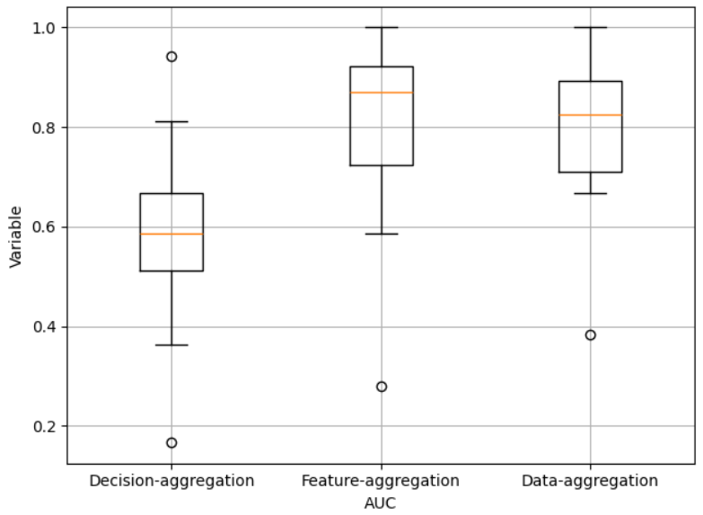
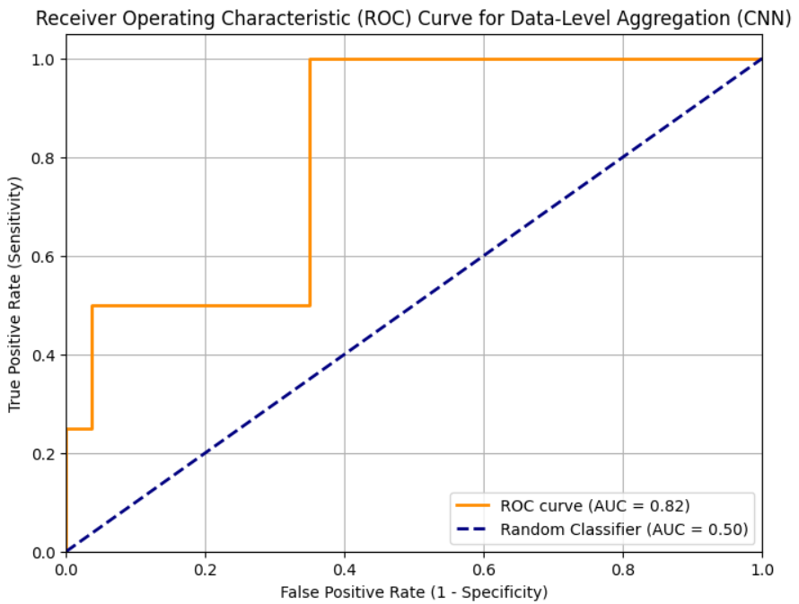

# 🧠 Predicting SBT Outcomes in the ICU Using Physiological Data

> **Author:** Yazdan Ghanavati  
> **Course:** E-Health Laboratory – University of Padova  
> **Lab Number:** 5

## 📌 Overview

This project explores three different strategies to predict the outcome of a **Spontaneous Breathing Trial (SBT)** using multivariate physiological data recorded in ICU settings. The objective is to identify the most effective data diffusion and classification method.

## 🔍 Problem Setting

In critical care, predicting whether a patient can be successfully weaned from mechanical ventilation is vital. The project uses real-world physiological signals (e.g., SpO₂, HR, RR) to forecast the success or failure of SBTs.

## 🛠️ Approaches Compared

1. **Decision-Level Aggregation**  
   Separate classifiers for each signal; final decision via majority voting.

2. **Feature-Level Aggregation**  
   Hand-crafted statistical features from all signals are concatenated and fed into a unified classifier.

3. **Data-Level Aggregation (CNN)**  
   A 1D Convolutional Neural Network processes raw multivariate time series directly.

## 🧪 Evaluation Methodology

- **Cross-Validation:** Patient-aware (20–30 iterations)  
- **Metric:** AUC (Area Under the ROC Curve)  
- **Dataset Size:** 353 entries

## 📊 Results

| Method                   | Mean AUC Score |
|--------------------------|----------------|
| Decision-Level Aggregation | 0.646          |
| **Feature-Level Aggregation** | **0.865**     |
| Data-Level Aggregation (CNN) | 0.815         |

### 🔹 Visualization

### 🔸 CNN ROC Curve

## 🧠 Key Insights

- Feature-level aggregation outperformed all, likely due to the **stability and interpretability** of hand-crafted features on a relatively small dataset.
- The CNN performed strongly but didn’t surpass the feature-level method — more data or improved architectures could close the gap.
- Decision-level models underperformed due to the lack of signal interdependency modeling.

## 🚀 Future Work

- Experimenting with deeper or hybrid CNN-RNN architectures.
- Applying regularization, batch normalization, and hyperparameter tuning.
- Expanding dataset size to better leverage deep learning.

## 📂 Repository Structure

